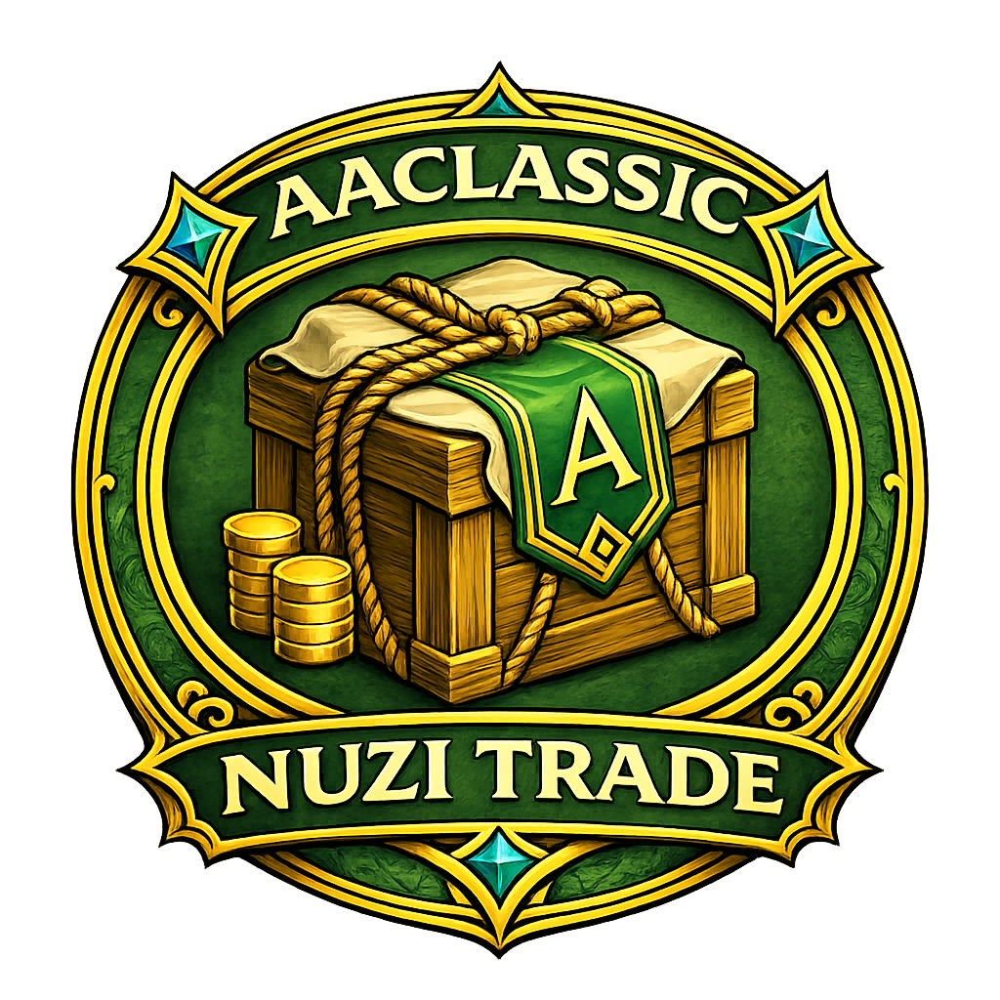

# Nuzi Trade

Trade routing without spreadsheet roleplay.

`Nuzi Trade` keeps the useful trade tools in one place:

- browse routes by origin, pack, destination, turn-in percent, and vehicle type
- compare a single destination or `All Destinations`
- keep a movable launcher icon with adjustable size
- route timer stopwatch window for real timed runs
- save route times per route and per vehicle type
- open a separate `Zones` window for watched conflict zones

## Install

1. Install `nuzi-trade` the Addon Manager.
2. Make sure the addon is enabled in game.
3. Click the launcher icon to open the trade browser.

Saved data lives in `nuzi-trade/.data` so route timers and settings survive updates.

## Quick Start

1. Open `Nuzi Trade`.
2. Pick an origin.
3. Refresh to update pack list.
4. Pick a destination.
5. Set the percent you want to evaluate.
6. Click `Refresh` to rebuild the table for the current selection.
7. Open `Zones` if you want the watched-zone status window beside it.
8. Use the launcher size slider if you want the icon larger or smaller.

That is still much nicer than pretending your memory is a market tool.

## How To

### Trade Browser

The main window lets you:

- choose an origin to rebuild the available pack and destination lists
- filter by a specific pack or use `All Packs`
- filter by a specific destination or use `All Destinations`
- compare values with a custom percent input
- switch between `Hauler`, `Car`, and `Boat` timing context. (You need to do your own runs and save per vehicle type to populate the table.)

`Refresh` rebuilds the table from the current origin, pack, destination, and percent instead of guessing what you meant.

### Zones Window

Click `Zones` to open the separate watched-zone window.

It tracks:

- `Diamond Shores`
- Nuia: `Cinderstone Moor`, `Halcyona`, `Hellswamp`, `Karkasse Ridgelands`, `Sanddeep`
- Haranya: `Hasla`, `Perinoor Ruins`, `Rookborne Basin`, `Windscour Savannah`, `Ynystere`

The window can stay open on its own, and the displayed timer counts down from the last live refresh so you can glance at it instead of doing clock math in your head.

### Route Timer

The timer window lets you time a specific route and save the result.

Saved route times are remembered per route and per vehicle type, which is the important part if you want to plan how many runs you can fit in a peace window you carebear.

## Notes

- Route timing data is stored separately under `.data/route_times.txt`. (Users can share their own runs)
- Trade browsing uses bundled pack price data, so the route table still works even if live APIs are limited.
- Zone-state data is read from the live client when available and falls back cleanly when it is not.
- If you change a saved route time, it is meant to reflect your route and your vehicle, not universal truth.

## Version

Current version: `1.0.0`
